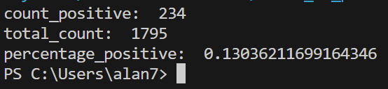

Alan DROMAS, Antoine FERREIRA, Emanuel EDMOND

We had difficulty to evaluate the system

How to use:
Install the requirements using "pip install -r requirements.txt"

Run the command "streamlit run __init__.py" in a command window to run the GUI

Upload a pdf file of your resume and it will provide the most relevant jobs

